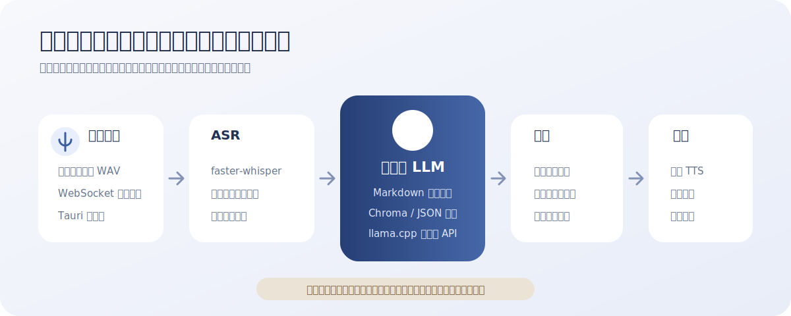

# Local Voice Memory Assistant

> 本地优先、可替换模型组件、使用 Markdown 持久化学习记忆的 Windows 英语口语助手实验项目。




## 项目状态

这是一个保留完整架构边界的实验项目，不是开箱即用的成熟语音产品。仓库已经实现录音、流式事件、对话管线和持久化学习记忆，但默认适配器包含降级行为，最终识别、回答和朗读效果高度依赖本机模型、驱动与硬件。

适合：

- 研究本地 ASR、LLM、向量检索和 TTS 的组合方式。
- 验证“长期学习画像 + 当前对话”的口语练习体验。
- 作为 Tauri + FastAPI 本地桌面应用的参考实现。

不适合：

- 需要零配置、低延迟、商业级语音质量的用户。
- 需要多人账号、云同步、移动端或在线课程内容的场景。
- 把模拟降级回复误当成真实模型输出的评测。

## 已实现能力

- `Tauri + React + TypeScript` Windows 桌面界面。
- 按住说话录音，浏览器端编码 WAV 后发送给本地后端。
- FastAPI + WebSocket 流式事件协议。
- Python 对话管线：ASR → 记忆检索 → LLM → TTS。
- `memory.md` 作为长期学习记忆的可读主存储。
- Chroma 向量索引，不可用时回退到本地 JSON 索引。
- `faster-whisper`、`llama.cpp` 和 TTS 的可替换适配层。
- OpenAI-compatible 云端模型接口，可与本地 LLM 自动切换。
- Memory 面板展示学习画像、偏好、常练主题和高频错误摘要。

## 降级语义

| 组件 | 正常模式 | 不可用时 |
| --- | --- | --- |
| ASR | `faster-whisper` 本地模型 | 返回明确标记的模拟转写 |
| LLM | `llama.cpp` 或兼容 API | 返回本地骨架回复 |
| Vector | ChromaDB | 回退为 JSON 索引 |
| TTS | 可替换适配器 | 前端使用 `speechSynthesis` 朗读 |

降级模式用于开发链路验证，不代表真实语音能力已经可用。排障时应先查看 `/health` 返回的 provider 和 backend mode。

## 快速开始

### 环境要求

- Windows 10/11
- Node.js 20+
- Python 3.11
- 可选：Rust 工具链，用于 Tauri 桌面壳
- 可选：本地 Whisper 和 GGUF 模型

### 安装依赖

```powershell
git clone https://github.com/ddbbiii/local-voice.git
cd local-voice
npm install
py -3.11 -m venv .venv
.\.venv\Scripts\python.exe -m pip install -r backend\requirements.txt
```

### Web 调试

终端一：

```powershell
.\.venv\Scripts\python.exe -m backend.app
```

终端二：

```powershell
npm run dev
```

也可以运行 `Start-Web.cmd` 同时启动前后端。默认开发端口为前端 `5173`、后端 `8765`。

### Tauri 桌面版

安装 Rust 工具链后：

```powershell
npm run tauri:dev
```

`Start-Desktop.cmd` 会使用项目自己的 `.venv` 启动桌面开发环境。`Stop-Assistant.cmd` 用于停止默认开发端口上的进程。

## 模型配置

模型路径和 provider 应通过本机设置提供，不要把个人绝对路径或密钥提交到仓库。

启用 OpenAI-compatible API：

```powershell
$env:ASSISTANT_LLM_API_BASE="https://provider.example/v1"
$env:ASSISTANT_LLM_API_MODEL="your-model"
$env:ASSISTANT_LLM_API_KEY="your-api-key"
```

然后在 `.assistant_data/config/settings.json` 中选择：

```json
{ "llm_provider": "api" }
```

使用 `auto` 时，如果 API 环境变量齐全则优先云端，否则尝试本地 `llama.cpp`。API Key 只从运行时环境读取，不应写入默认设置或提交到 Git。

## 学习记忆

- Markdown 是可读、可备份的长期记忆主存储。
- 后端启动时压缩记忆并重建检索索引。
- 记忆优先保留学习画像、纠错偏好、常练主题和高频错误类型。
- `GET /api/memory` 返回当前学习记忆快照。
- `POST /api/memory/rebuild` 从 Markdown 重建检索索引。
- 前端只展示摘要和分类条目，不直接编辑 Markdown 原文。

## 目录结构

```text
src/                 React 前端
src-tauri/           Tauri 桌面壳
backend/             FastAPI、适配器和对话管线
scripts/             构建与冒烟测试脚本
.assistant_data/     本机运行数据，默认不提交
```

## 排障与验证

```powershell
.\Check-Runtime.cmd -SkipHealth
.\Check-Runtime.cmd
.\Smoke-Memory.cmd
npm run build:frontend
```

`Check-Runtime.cmd` 检查虚拟环境、模型文件、关键 Python 包和端口；`Smoke-Memory.cmd` 不加载大模型，只验证 Markdown 写入、重载、错误提取和索引重建。

## 隐私与边界

本地模式下，音频、转写和学习记忆不需要离开电脑。选择云端 API 时，发送给模型的文本受对应服务条款约束；仓库不会替用户上传或同步记忆。请勿把 `.assistant_data`、模型配置、API Key 或真实对话记录提交到公开仓库。

## License

当前仓库尚未添加开源许可证。在许可证确定前，源码可以公开查看，但不自动授予复制、修改或分发权利。
